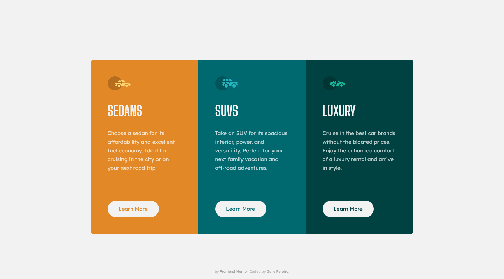

# Frontend Mentor - 3-column preview card component solution

This is a solution to the [3-column preview card component challenge on Frontend Mentor](https://www.frontendmentor.io/challenges/3column-preview-card-component-pH92eAR2-).

-------
## Table of contents
-------
- [Overview](#overview)
  - [The challenge](#the-challenge)
  - [Screenshot Solution](#screenshot-solution)
  - [Links](#links)
  - [Built with](#built-with)
- [Author](#author)

-------
## Overview
-------

### The challenge

Users should be able to:

- View the optimal layout depending on their device's screen size
- See hover states for interactive elements

### Screenshot Solution

| Desktop | Mobile |
|---|---|
|||

-------

### Links

- Live project on [GitHub](https://guilepereira.github.io/3-column-card/)

- Solution on [3-Column Component by Guile Pereira](https://www.frontendmentor.io/solutions/3column-preview-card-component-okt1NW5nLw)
-------

### Built with

- Semantic HTML5 markup
- CSS custom properties
- Flexbox
- Grid
- Accessibility;
- Methodology BEM (Block Element Modifier);
- Atomic Design.

## Author

- LinkedIn - [Guile Pereira](https://www.linkedin.com/in/guilevpereira/)
- GitHub - [Guile Pereira](https://github.com/guilepereira)
- Frontend Mentor - [@guilepereira](https://www.frontendmentor.io/profile/guilepereira)